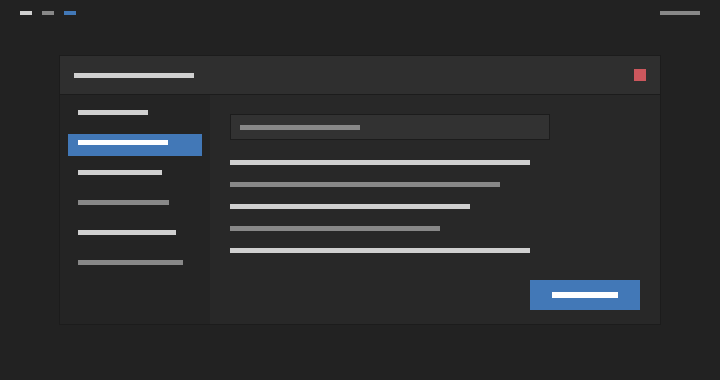

# Arc Babu Gray

A personal **neutral-gray** fork of the [Arc theme](https://github.com/jnsh/arc-theme),
recolored to match a gray i3 / polybar setup. Arc's blue-tinted greys are
neutralized to true gray, and the bright blue accent is replaced with a muted
gray-blue.



> A schematic mockup (header, sidebar, selection, accent button, close button)
> rendered with the actual theme colors on a polybar-colored backdrop — not a
> live screenshot. Build and install to see it on real widgets.

## Palette (dark variant)


| Role | Color | |
| --- | --- | --- |
| Window body (`bg_color`) | `#282828` | matches alacritty / rofi / dunst background |
| Entries, list views (`base_color`) | `#323232` | one step lighter than the body |
| Headerbar / titlebar (`header_bg`) | `#2f2f2f` | sits clearly above the `#222` polybar |
| Dark sidebar (`dark_sidebar_bg`) | `#242424` | |
| Window border | `#1c1c1c` | defines the window edge against the bars |
| Foreground / text | `#d0d0d0` | matches alacritty / rofi / dunst foreground |
| Accent / selection (`selected_bg_color`) | `#4278b7` | muted gray-blue |
| Window close button | `#cc575d` | kept red, in line with the dunst-critical red |

## Why these colors

* **Sourced from my dotfiles.** `#282828` background and `#d0d0d0` text come
  straight from my `alacritty`, `rofi` and `dunst` configs; the `#4278b7` accent
  is the muted gray-blue I'd already settled on in `arc-undead-custom`. The goal
  was a GTK theme that sits next to the terminal and bars without clashing.
* **No blending with the polybar.** Every window surface is kept *lighter* than
  the `#222` polybar — the darkest piece of window chrome is the `#2f2f2f`
  headerbar — and windows carry a `#1c1c1c` border. So a file manager (or any
  app) never merges into the top or bottom bars.
* **Everything else stays gray, consistently.** All the remaining greys across
  the theme — gradients, borders, scrollbars and the rendered widget assets —
  are neutralized the same way by `tools/recolor-gray.py`.
* **Semantic colors are left alone.** Warning / error / success, the red
  window-close button, and the GNOME / libadwaita named palette keep their
  meaning so apps still read correctly.

## Building and installing

The recolor is reproducible from one script, `tools/recolor-gray.py`, which
remaps colors across the SCSS sources, the SVG asset sources, and the GTK2
`gtkrc` files. The core GTK palette files are already recolored in this repo; to
recolor the rest (all SVG widget assets and the other desktop-environment
sources) run it once, then build with Meson:

```bash
python3 tools/recolor-gray.py common

meson setup --prefix=$HOME/.local -Dvariants=dark build/
meson install -C build/
```

Build dependencies: `meson`, `sassc`, and `inkscape` (to render the GTK PNG
widget assets from the recolored SVG sources). The script is idempotent, so
re-running it is safe.

To tweak the palette, edit `EXPLICIT_OVERRIDE` in `tools/recolor-gray.py` (or the
`$bg_color` / `$selected_bg_color` etc. variables in `common/gtk-*/sass/_colors.scss`)
and rebuild. For example, to push the body darker toward the terminal, set
`bg_color` to `#222222`; to give it more separation from the polybar, raise it to
`#2c2c2c`.

## License

Arc is available under the terms of the GPL-3.0. See [COPYING](COPYING) for
details. Originally created by [horst3180](https://github.com/horst3180/arc-theme),
maintained upstream by [jnsh](https://github.com/jnsh/arc-theme).
